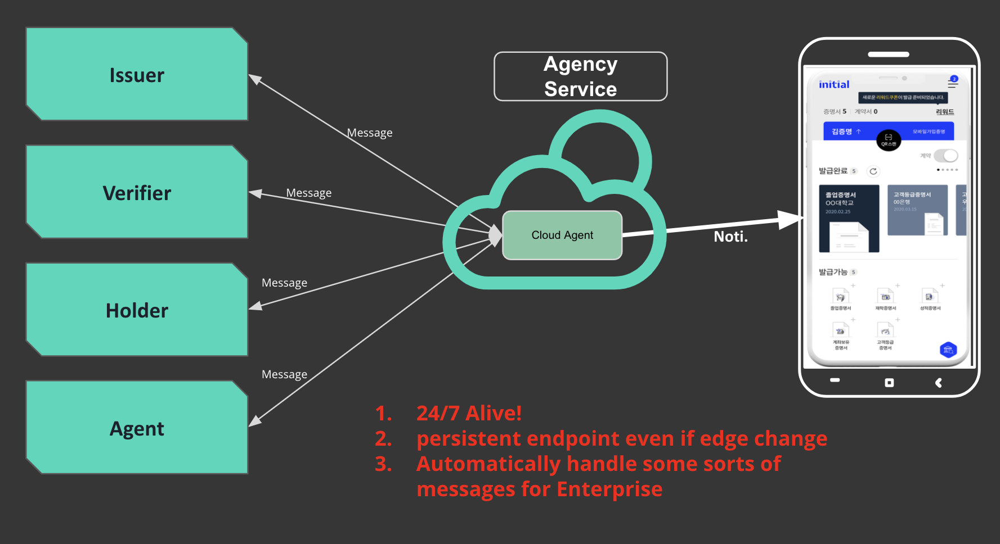
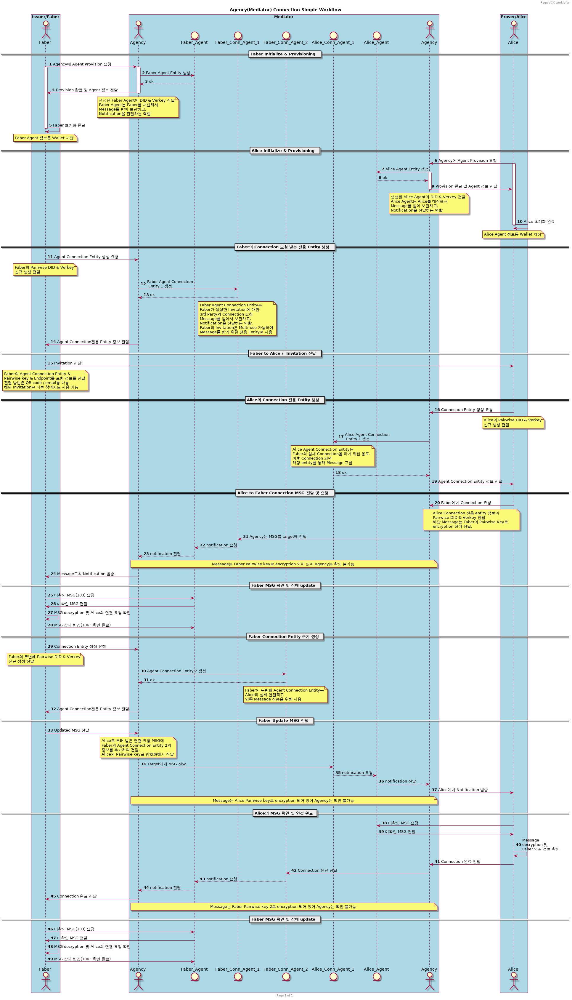

#### Agency의 역할 및 사용법
 
more specifically [Mediator Agency](https://github.com/hyperledger/aries-rfcs/blob/master/concepts/0046-mediators-and-relays/README.md
) in Aries

## Agency란?
Agency는 Peer간 연결을 위한 End point를 담당하고, 암호화된 Message를 전달하는 Mediator의 역할을 한다. 
Peer들의 Agent가 Agency 내부에 생성되고 Peer들의 각각의 서버로서 기능을 하게 된다.
Peer가 Offline 상황에서도 항상 Encrypted Message를 받아 임시보관하고, 전달할 수 있는 기능을 제공한다. 

## Agency 사용

Hyperledger VCX Protocol 기반 Agency 사용을 원하는 Mobile App 개발사는 
Auth 인증을 위한 API Key 발급 필요.

contact : jaehyeon.ju@sk.com

## Agency Workflow
* `Faber` - Issuer/Verifier등 기관. 
* `Alice` - Holder등 사용자.
* `Agency` - Initial Platform의 message 전달을 담당하는 Hub.
* `Agent Entity` - Issuer/Verifier/Holder의 Cloud Agent. Notification을 담당.
* `Connection Agent Entity` - 각각 Pairwise 연결 담당.

### Entities
Agnecy는 Entity의 개념을 중심으로 구축됩니다.  
Agency는 여러 유형의 Entity를 포함합니다.  
먼저 Entity의 특성을 살펴 보겠습니다. 

#### Entity definition

- Entity has DID (EntityDID, E-DID)
- Entity has Verkey (EntityVkey, E-Vkey)
- Entity is addressable by DID and by Verkey
- Entity has wallet
- Entity can be read/written using Entity Access Object (AO)
- AO can be be restored from Entity Record
- Entity Record is generated upon initial creation of Entity data.

#### Entity types

- Forward Agent (FWA)
- Agent
- Agent-Connection

##### Entity Forward Agent (FWA)

- 오직 1개의 FWA만 존재함. FWA는 Agency 그 자체.
- Agency의 Agent를 대표
- Agency와 Peer간 초기화 통신의 보안성 확보
- Agency에 Agent를 생성하는 포인트 제공 

##### Entity Agent

- Agent is the "Account" a client creates in Agency. Basically mailbox accepting messages on client's behalf.
- Agent can create entities of Agent-Connection type. It represent pairwise connection with 3rd party.
- Agent knows EntityDIDs of its Agent Connections
- Agent knows UserPairwiseDid of its Agent Connections

##### Entity Agent-Connection

- Agent-Connection represent mailbox for pairwise connection with a 3rd party.
- Agent-Connection knows EntityDID of Agent it belongs to.
- Agent-Connection has associated UserPairwiseVKey. Agent-Connection owner must use UserPairwiseVKey to communicate with this entity. 
- Agent-Connection has associated UserPairwiseDID. It is how Agent-Connection owner identifies the pairwise connection with 3rd party.

### Capabilities

#### Entity Agent
- Agent can retrieve messages across all its connections. Message store must require AgentDID for any message retrieval.
- Agent can retrieve messages by Agent-Connection's UserPairwiseDIDs.
