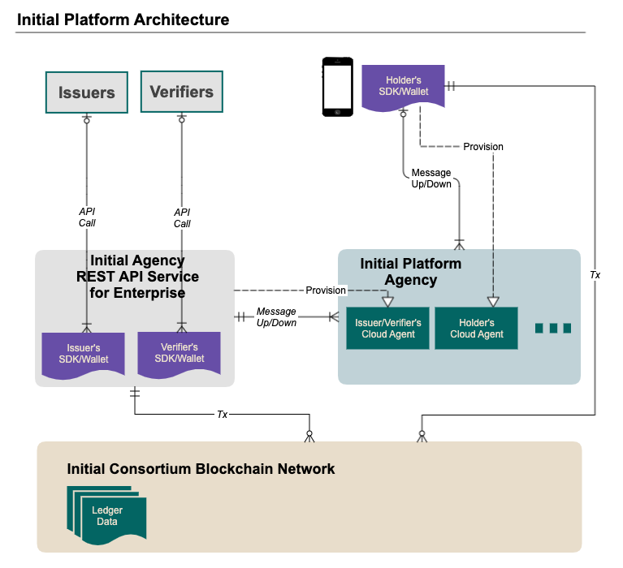

Blockchain Network Node
===============

Initial은 대한민국에서 가장 신뢰있는 기관들이 모여 이니셜 컨소시엄 Blockchain Network를 구성하고 제공합니다. 
Initial Network는 Private 형태로 승인된 관계자만 참여/접근 가능합니다.
> 참조 : https://www.sktelecom.com/advertise/press_detail.do?idx=5122

## 1. Blockchain Network Infra

* Hyperledger Fabric 기반 기술을 사용하여 최상의 Enterprise 경험을 제공합니다.

- Hyperledger Fabric(SDK) <https://github.com/hyperledger/fabric>

