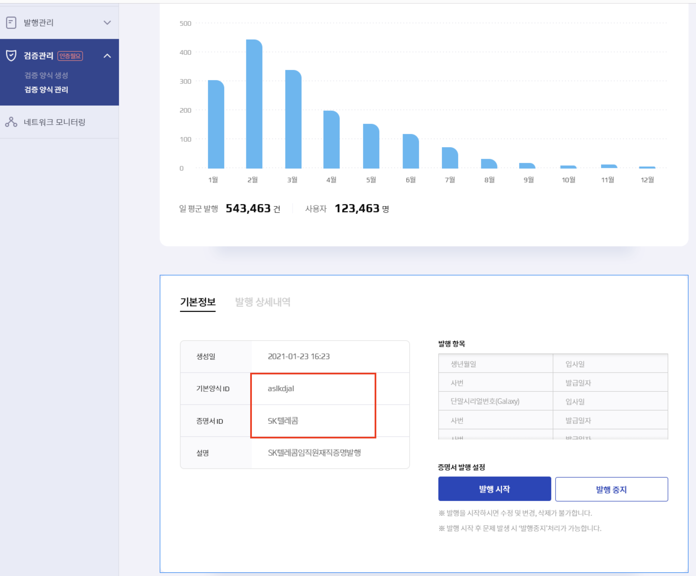

Schema & Credential Definition Example
================

### STEP 1. 기본증명(Schema ID) 생성하기 

<div class="admonition note">
<p class="admonition-title">note</p>
<p> 기본증명양식(Schema ID)은 initial 관리자가 생성하여 제공함. 기본 제공하는 양식을 사용하거나 아래 양식에 맞춰 관리자에게 신규 생성 요청 가능함  </p>
</div>

- 기본증명(Schema ID) 생성요청 예시

 항목 | 한글 | 영어
 --- | --- | ---
 한글명 | 한글 스키마 제목 (e.g ID카드신청) | 영어 제목 (e.g IDCardApplication) 
 Schema ID (개발)| 생성 후 발급  | (e.g. N6r4nLwAkcYUX8c8Kb8Ufu:2:IDCardApplication:1.0)
 Schema ID (운영) | 생성 후 발급  | (e.g. N6r4nLwAkcYUX8c8Kb8Ufu:2:IDCardApplication:1.0)
 Attribute #1 | 사업장코드 | contract_no
 Attribute #2 | 카드번호  | mid
 Attribute #3 | 사원(학생)번호 | employee_no 
 Attribute #4 | 이름 | name
 Attribute #5 | 한글... | English...
 ... | ... | ...

  
<br><br>

### STEP 2. 증명서발행양식(Credential Definition ID) 생성하기 


<div class="admonition note">
<p class="admonition-title">note</p>
<p> Web Console 증명서 발행양식생성에서 진행  </p>
</div>

아래와 같이 증명서ID(Credential Definition ID) 정보를 확인 해야함.<br>
해당 정보 기반으로 증명서 생성 가능. 




<br><br>

### [Option] 증명서발행양식(Credential Definition ID) 검색하기  

* Method and Resource

    `POST` `/credential-definitions/created` 내가 생성한 credential definition 검색 
<p></p>

* Parameter

     Name | Description 
     --- | --- 
     cred_def_id | credential definition id 직접 검색  
     issuer_did | 발행자(issuer 기관) public did로 검색 
     schema_id | 특정 SchemaID 기반으로 관련된 credential definition id 검색  
     schema_issuer_did | schema ID 를 생성한 issuer public did 기반 검색  
     schema_name | schema name 기반으로 검색 
     schema_version | schema version 으로 검색  

<p></p>

<br>
    * Response body (검색결과)
```json
{
  "credential_definition_ids": [
    "WgWxqztrNooG92RXvxSTWv:3:CL:20:tag"
  ]
}
```
<br><br>

### [Option] 특정 증명서발행양식(Credential Definition ID) 상세내용 검색하기  

* Method and Resource

    `POST` `/credential-definitions/{cred_def_id}` 특정 증명서발행양식(Credential definition ID) 정보 가져오기  
<p></p>

<br>
    * Response body (검색결과)
```json
{
  "credential_definition": {
    "type": "CL",
    "tag": "tag",
    "ver": "1.0",
    "schemaId": "20",
    "id": "WgWxqztrNooG92RXvxSTWv:3:CL:20:tag",
    "value": {}
  }
}
```

<br><br>

### [Option] 기본양식(Schema ID) 검색하기  

* Method and Resource

    `POST` `/schemas/created` 기본양식(Schema ID) 검색하기   
<p></p>

* Parameter

     Name | Description 
     --- | --- 
     schema_id | 특정 SchemaID 기반으로 관련된 credential definition id 검색  
     schema_issuer_did | schema ID 를 생성한 issuer public did 기반 검색  
     schema_name | schema name 기반으로 검색 
     schema_version | schema version 으로 검색  

<p></p>

<br>
    * Response body (검색결과)
```json
{
  "schema_ids": [
    "WgWxqztrNooG92RXvxSTWv:2:schema_name:1.0"
  ]
}
```


### [Option] 특정 기본양식(Schema ID) 상세내용 검색하기  

* Method and Resource

    `POST` `/schemas/{schema_id}` 특정 기본양식(Schema ID) 정보 가져오기  
<p></p>

<br>
    * Response body (검색결과)
```json
{
  "schema": {
    "version": "1.0",
    "attrNames": [
      "score"
    ],
    "ver": "1.0",
    "name": "schema_name",
    "id": "WgWxqztrNooG92RXvxSTWv:2:schema_name:1.0",
    "seqNo": 10
  }
}
```