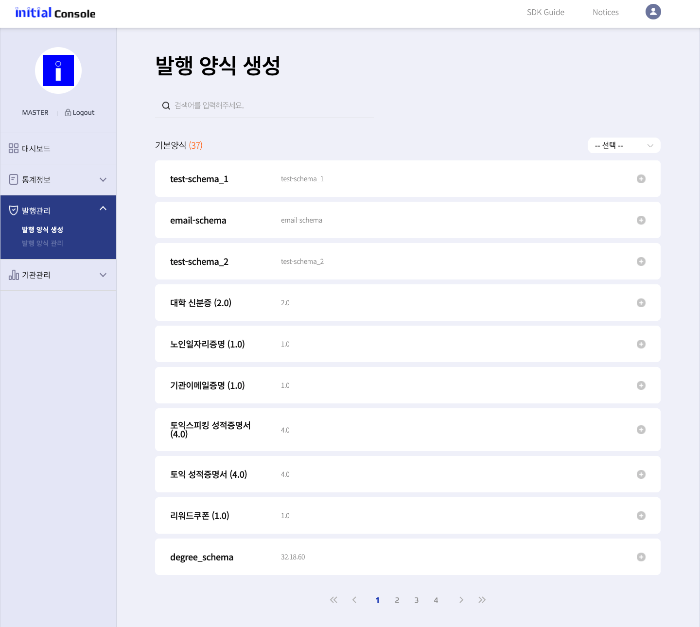

Schema & Credential Definition Example
================

### STEP 1. 기본증명(Schema ID) 생성하기 

note

 기본증명양식(Schema ID)은 initial 관리자가 생성하여 제공함. 기본 제공하는 양식을 사용하거나 아래 양식에 맞춰 관리자에게 신규 생성 요청 가능함  

- 기본증명(Schema ID) 생성요청 예시

 항목 | 한글 | 영어
 --- | --- | ---
 한글명 | 한글 스키마 제목 (e.g ID카드신청) | 영어 제목 (e.g IDCardApplication)
 Attribute #1 | 사업장코드 | contract_no
 Attribute #2 | 카드번호  | mid
 Attribute #3 | 사원(학생)번호 | employee_no 
 Attribute #4 | 이름 | name
 Attribute #5 | 한글... | English...
 ... | ... | ...

- Schema ID (개발) | 생성 후 발급  | (e.g. N6r4nLwAkcYUX8c8Kb8Ufu:2:IDCardApplication:1.0)
- Schema ID (운영) | 생성 후 발급  | (e.g. N6r4nLwAkcYUX8c8Kb8Ufu:2:IDCardApplication:1.0) 
 
  

### STEP 2. 증명서발행양식(Credential Definition ID) 생성하기 

note

 Web Console 증명서 발행양식생성에서 진행  

아래와 같이 기본양식(SchemaID)기반으로 발행양식(Credential Definition ID)을 생성해야 함. 
해당 정보 기반으로 증명서 발행 가능. 
아래와 같이 '발행 양식 생성'에서 사용할 기본양식(Schema)를 선택하고, 발행양식 생성 완료.

 
생성이 완료되면 아래와 같이 정보가 표시 됨 
증명서ID가 발행을 위한 정보 입니다. 

