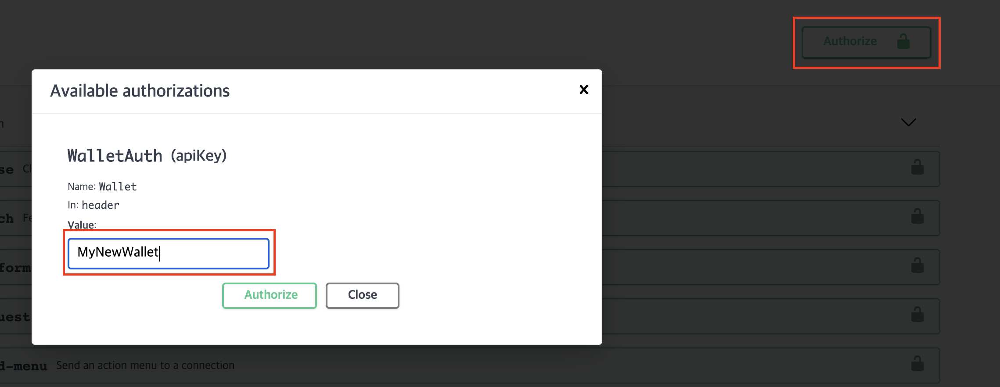

Wallet and Create Authorize & DID 
================

**Admin** page에 접근하기 위해서는 Wallet의 생성이 필요
<br>

<div class="admonition warning">
<p class="admonition-title">Warning</p>
<p> Cloud Agent 접속을 위해 Auth 필요. Local demo에서는 직접 생성할 수 있지만, 실제 서비스에서는 관리자에게 생성 요청해야 함 </p>
</div>
    

<p></p>
Cloud Agent 생성을 위해서는 Authorize 필요 <br>
아래는 local demo 기준 설명 <br>
Demo의 최초 Wallet Auth는 docker-compose.yml 파일의 `admin`으로 세팅되어 있음

```json
 "--wallet-type", "indy",
 "--wallet-name", "admin",
 "--wallet-key", "admin.key",
```

위 정보를 http://localhost:8021/api/doc#/ 접속하여 아래 그림과 같이 authorize 버튼 클릭 후 `admin`을 입력해야 동작 가능


<br>
이후 아래와 같이 `header`값에 `wallet`의 parameter에 wallet name이 있어야 동작 가능

`curl -X GET "http://localhost:8021/wallet" -H "accept: application/json" -H "Wallet: admin"`

<p></p>

### STEP 1. Admin Authorize and Create Wallet.

* Method and Resource

    `POST` `/wallet` Cloud Agent에 새로운 wallet 생성하기

<p></p>

* Parameter

     Name | Description 
     --- | --- 
     seed | Seed used for did derivation (example: aaaaaaaaaaaaaaaaaaaaaaaaaaaaaaaa)
     wallet_key | Master key used for key derivation(example: MySecretKey123)
     wallet_name | Wallet identifier (example: MyNewWallet)            
     wallet_type | string (example: indy)


<p></p>

* Example 

    * input <br>
    `seed` : `aaaaaaaaaaaaaaaaaaaaaaaaaaaaaaaa`<br>
    `wallet_key` : `MySecretKey123`<br>
    `wallet_name` : `MyNewWallet`<br>
    `wallet_type` : `indy`<br>
    
    


<br>
    * Response
```json
Code 201
Created
```
    
<p></p>
* Next Step
<br>
다시 한번 authorize를 클릭하여 기존 admin은 logout하고 새로 생성한 `MyNewWallet`으로 login 하여 demo 진행     


<div class="admonition warning">
<p class="admonition-title">Warning</p>
<p> Demo에서는 Cloud Agent 재실행 시 Wallet의 data는 모두 초기화  </p>
</div>
<br>
<br>


### STEP 2. Wallet DID 확인

* DID는 크게 두가지 종류가 존재한다.

    - Public DID : Blockchain Ledger에 등록된 DID. 등록되는 정보는 아래와 같다.
    >> Alias: alice.77.8.11@test.com  | `별칭` <br>
    >> Nym: 8icAACfA19raHA2rfdVXo3  | `DID` <br>
    >> Role: ENDORSER  | `Role`  <br>
    >> Verkey: 5CxiP6UCH8CCvdn3ciJHwoRfUkpmobMxQuMUKMCPCjvg | `verkey` <br>
    >> endpoint: http://localhost/agent/endpoint | `endpoint` <br>

    - Local DID : Local에만 존재하고 Pairwise DID(Connection DID) 전용으로 주로 사용된다.
 
 <br>
 
* Method and Resource

    `GET` `/wallet/did` 내 Wallet내 DID 확인하기 
<p></p>

* Parameter

     Name | Description 
     --- | --- 
     did | 특정 did를 입력하여 찾을 수 있음 
     public | (true/false) Public DID를 선택할 수 있음 
     verkey | 특정 Verkey로 DID를 찾을 수 있음            


<p></p>

* Example 

    * input <br>
    `did` : ` ` <br>
    `verkey` : ` ` <br>
    `public` : ` `
<p>
</p>

* Response

```json
{
    "results": [
        {
            "did": "24cZcWLJH9BPKHXsWEGEfE",
            "verkey": "aaiMDNMekeReMVZirB6Kas9xnDtS6CMGSYmR87Q6uMK",
            "public": false
        },
        {
            "did": "LU1KBb2AGFU5pwV2jBJMcz",
            "verkey": "BcM62BjQdqr9V6BFA1UxaWNzWfsbz6fkykBsPghBVyqQ",
            "public": true
        },
        {
            "did": "N5Q8RMDjchEoLYf5LCdoNr",
            "verkey": "CVFSCoBPVTQFJf5pSG5xGq6FYYJwunKbAWwQz9m4NMDy",
            "public": false
        }
    ]
}
```
    
<p></p>
<div class="admonition note">
<p class="admonition-title">note</p>
<p> Initial 개인 사용자는 Public DID가 존재 하지 않음. 어떠한 개인정보 공개되지 않음 </p>
</div>


<br><br>

### STEP 3. Public DID Ledger 등록하기 

Node에 접근 하기 위해서는 DID의 Auth Setting이 필요함 <br>

기본적인 Node의 Auth Rule은 아래와 같음

Auth | Description
--- | ---
None (common USER) | 일반 사용자 (Public DID)
“0” (TRUSTEE) | 모든 권한을 부여할 수 있는 Super User. Steward, Endorser 및 network_monitor 권한을 부여할 수 있다.
“2” (STEWARD) | Endorser 권한을 생성할 수 있다.
“101” (ENDORSER) | Node transaction을 할 수 있는 최소 권한. VC를 issue 하기 위해서는 최소 endorser 권한이 필요하다. Initial에 가입한 기관에게 기본으로 주어지는 권한.
“201” (NETWORK_MONITOR) | -
none or User | Public DID가 Ledger에 등록되어 있는 일반 사용자

<p></p>
* Method and Resource
    - `POST` `/wallet/did/create` 신규 DID를 Local wallet에 생성할 수 있다.
    - `POST` `/ledger/register-nym` 생성된 DID에 권한을 부여하고 Ledger에 등록한다. 최소 Steward 이상 권한만 가능하다.
   
   
<div class="admonition Note">
<p class="admonition-title">Note</p>
<p> Initial 개발 Cloud Agent에서 계정을 생성하면 기본적으로 Endorser 권한이 부여되어 VC 발급등 가능하다.</p>
</div>
 
* Method and Resource

    `POST` `/ledger/register-nym` Ledger에 DID registration
<p></p>

* Parameter

     Name | Description 
     --- | --- 
     did | 등록하기 위한 DID
     alias | Alias 
     verkey | verkey key          
     role | Available values : STEWARD, TRUSTEE, ENDORSER, NETWORK_MONITOR, reset          


<p></p>

* Example 

    * input <br>
    `did` : `CPKosDtWE5vGe6F6mJctsB` <br>
    `verkey` : `7Cu9pmqGktnm3cRSRksgTfexUEEJuGy4TQwQu2B2XEqc` <br>
    `alias` : `faber@sk.com` <br>
    `role` : `reset` // 기본으로 주어지는 Endorser 권한으로는 reset(User)만 가능하다.

<p>
</p>

* Response

```json
{
    "success": true
}
```

* Next Step

`GET` `/ledger/get-nym-role`으로 확인하면 User(Role)로 등록되어 있
```json
{
    "role": "USER"
}
```
<br><br>


### STEP 4. Wallet 대표 Public DID 변경등록하기 

Initial Platform 참여자는 기본적으로 Public DID가 생성되고, Endorser 권한이 부여된다.<br>
Endorser 권한을 가지는 사용자는 새로운 Endorser를 생성할 수 없기 때문에, 만약 대표 Public DID 변경을 원하면 Initial Platform 관리자에게 문의해야 함. <br>
아래 예제는 API 소개 용도.

 
* Method and Resource

    `POST` `/wallet/did/public` 대표 Public DID 새로 등록하기
<p></p>

* Parameter

     Name | Description 
     --- | --- 
     did | 등록하기 위한 DID      


<p></p>

* Example 

    * input <br>
    `did` : `CPKosDtWE5vGe6F6mJctsB` <br>


<p>
</p>

* Response

```json
{
    "result": {
        "did": "CPKosDtWE5vGe6F6mJctsB",
        "verkey": "7Cu9pmqGktnm3cRSRksgTfexUEEJuGy4TQwQu2B2XEqc",
        "public": true
    }
}
```

