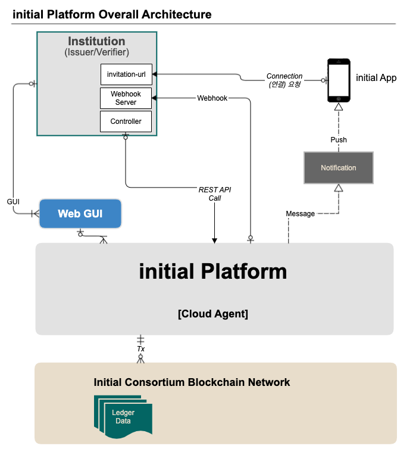

initial Platform DID Agent API 이용 개발 안내

## 기관 참여자 구현/개발이 필요 항목 
위 그림에서 기관사용자 영역의 3개 항목에 대해서 구현 필요

1. DID Agent API 요청 Controller 서버
2. Event 수신 Webhook 서버
3. 참여사 개인정보 수집 및 이용 동의서 전달 

### 1. DID Agent Controller 개발 안내 
- 기관사용자는 DID Agent API를 사용하기 위해 controller 서버를 개발해야 한다.
- initial Platform의 DID Agent는 Event Driven(이벤트 구동형) 방식이기 때문에 기관 사용자는 Webhook 서버를 개발하고 url 등록해아 한다.
- 자세한 API 내용은 initial DID Agent API Guide 및 reference code 참조 

  
### 2. Webhook 서버 개발 안내 
- initial DID Agent는 event driven 방식으로 REST API 요청에 대한 응답을 Webhook 서버로 전달합니다
- 처리결과를 받기 위한 기관 사용자의 Webhook URL은 기관정보에 필수 등록해야 합니다. e.g)https://domain.com/webhooks
- Webhook 서버의 API Key는 보안 강화를 위한 선택 사항입니다. https://domain.com/webhooks#org-api-key 와 같이 입력하시면 header의 x-api-key 항목에 값으로 "org-api-key"를 함께 전송합니다.
- 기관 사용자는 보안강화를 위한 IP기반 방화벽 설정 하세요 (initial platform의 IP대역 xxx.xxx.xxx.xxx/24는 별도로 안래 예정입니다)
- Webhook 서버 예제는 아래 reference code (DID 발행/검증 Demo)에서 확인할 수 있습니다. 

### 3. 참여사 개인정보 수집 및 이용 동의서 조회 전달 구현 안내 
- 모바일 initial App에서 참여사에게 본인확인증명을 제출하기 전 개인정보 수집 및 이용 동의를 받기 위해, 동의서 전달이 필요하다. 
- 동의서 전달은 DID Agent의 Message 전달 API를 이용한다. 상세 내용은 Message API 참조.

