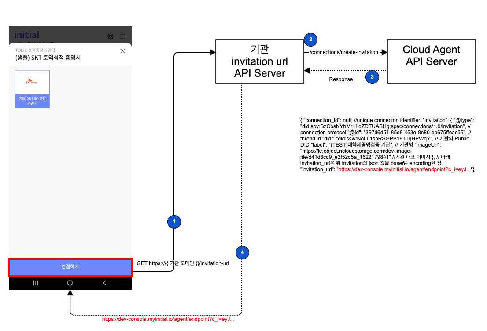
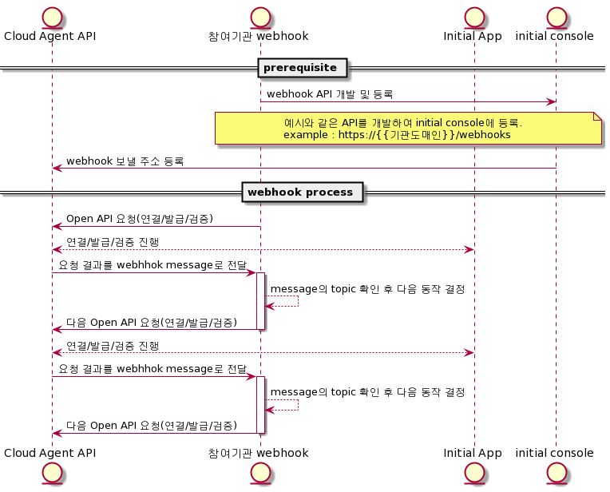

# **Web Console 개발 Guide**

initial Platform DID Agent API 이용 개발 안내


** 기관 참여자 구현/개발이 필요 항목 **

기관은 위 그림을 참고하여 Cloud Agent와 연동을 위한 Controller 개발이 필요합니다.

1. initial App과 최초 통신을 위한 연결(Connection)요청 API
2. Cloud Agent API 사용위한 Controller
3. Event 수신 Webhook controller

#### 1. initial Console 가입/기관 생성
- initial console 가입을 진행하고, Master 권한 신청 및 기관 생성을 진행한다.
- [가입 및 기관 생성](https://initial-v2-platform.readthedocs.io/web_console_signup/#1)

#### 2. 기본양식 확인 및 신규 생성
- initial Console에 접속하여 `디렉토리` - `기본양식 리스트`에 기관에서 사용하기 원하는 양식(Schema ID) 있는지 확인.
- 사용하고자 하는 양식이 있으면 그대로 사용 가능하고, 없다면 신규 생성을 요청해야 한다.
- 신규 양식 생성은 initial 관리자만 생성 가능함으로 [Schema 등록](https://initial-v2-platform.readthedocs.io/open_api_schema_creddef/) 참고하여 신청해야 한다.

#### 3. 발행양식 및 검증양식 생성 
- 아래 링크를 참고하여 발행양식과 검증양식을 생성한다. 이부분은 최초 기관생성 단계에서 skip 가능하다.
- [발행양식 생성](https://initial-v2-platform.readthedocs.io/web_console_signup/#4)
- [검증양식 생성](https://initial-v2-platform.readthedocs.io/web_console_signup/#6)

#### 4. API 및 Sample Code 확인
- 개발하기 전 아래 참고 사이트를 확인 한다.
- Open API [[Click]](https://app.swaggerhub.com/apis-docs/khujin1/initial_Cloud_Agent_Open_API/1.0.4#/)
- Issuer/Verifier JAVA Demo 소스코드 [[Click]](https://github.com/sktston/initial-controller-java)
- Issuer Demo Sequence Diagram [[Click]](https://plantuml.com/plantuml/uml/pLTTQnj75xxVNt782o-xO5dtHX9nugJrLKFI3tebrhiZQ_1gLvrTAGrfm4sLagA0dSQkvLGoBiLk4rogsY8uuFwPNcf7_w5dDAFT4IktSagXlj7ipfoFyvppFBE-7aOsYnerpo1-HAC7i1g63SB03k6QN5wRxDZhk1XltFI2XWlBuZdP_IYSMFaqehO7wb2zdXoXQaUSYb__7FTtUEzYsD_a1q_uSIz-_IJkTuVdtrmp3ADOX3eZZ7pMe26D21IBXZ4npvN6mPRWBtmOVe1MGPEmITI5iL7Y1FC2_lY4ltm5lDq5tXl4lvw3D8wtE_ox0V23f-9dj3k8ssyXtjhd1yzvRnDVjFZB7U1xN_FUiqKmD3JW_S1p2HDULqWjY8ykW7TRw44PZNQxoX5Yue98qZ0KubYMMYr1eHAWCoVm0bPSyngaL5WhtIThrI3O2FFKRzB8ZcZWm_ATLHZskvZs6BARWUyJPxmZ01C5wsv5pTJ1JSUZpWOMkwLRO7hyz1TJ3ys8AoB3NUm32IDuxzQ7yF2X6zHiwZzwf2MIQp3FCcnqrBGZeW9gXSdHcLsNYKLOUIT99CmxZA2NNEe-yImT6T9TJaTCfAO1i-fNC4knD6yXqFM0-j72dSOQ5WuhgokBYujMafwS9mbxflQx9AnZJaHtJj4vazubneMSLYEYvH3QdBBuVm9XMYUO-k3mWsqS3E2ddVZunCfME1kxJ-HC06cAu_cfTkwtuX-VWHa5TUgWkGRm0eIO5y6NOro9PRXa6k5vPp9rMgOkJhkY51Q31RN6n6htuhCMyCFT-6mG_z25bHluW7GzciGeQFWNa5NzuMa_oHvx1SkDg6f1gQHdgIRCq7WkNocQZpejVd22mGmDSEh25nhl16Ma5TnXGJq8RK_GHjZhCxiiTOMtkaeU9aoXOzEwDDN7Nrh-x_Rj6_ZthgsKYSbGQHV7CSiE3YVnfQgfLYPvb9aSFpV3noIZURkByF5U9-sfRA8vrNIBxsrFuu9FtwDCQhYP8j-oIohY_5XsqWBAv7EdQllh1FTGohxblPQQZwlt5hGuwYaR91q040Cm-n9HfUI7fvluebYyafJL6GdnJ0ux4bJok7HpM0EjK4Tg9PDIa6tFYiqsxjbUBIDu-bOoJvVVWX9rXB7BttJJhco9gmSRYdjvlllxSB29Hrfn-mHCSVqTj_BuEDhVYK-VZZhdyOlVB5EgafNXnD_4dEdmdKLDDa59WgX3N7cyTwv49IM70huy1ZvbXWGV2J7lt6iYbYr30nA5QdXsONvg2UMROeKW1LuGJfNwwtZrT_ZUYIPywixGioXS3gait_nOLF70KZ3CbCECZFzB5CADP98WVZn0iEGh7HDy8z73XOvVoZzaNrPS4wuby2ob0gGwFckwygad2uRd_RZV4JzYo17uUyHcJbLvJYxh9J0_g8lI4TKtEuYxyW-8Vtnu13Y8JKhkGuDvbzCTfZvT7ee7XEYHv7sDX266-cTKJvYE-O0e-DL04TUKQKzblG2yVIZWUZk8NuZfwICd1Pd136InsJ6HzDOHr-58L4Bk8fWC1qhSvVodB_dXSs3g6ydAZcGMyijraugZkNJa_jXiInI3IeMmGdwjLCWBuz9z6bKl6Kq5MK7xgEEjmz5NFVpopWwRqhUvbGbcNzAIalDSqbhIjhD1t6mlvhwSPGMoGrVKdsoNLD3fJx4CN9hs_1UL1HzbdjZh9FN4oMXh6_KW-O-iEz4IHffbHjOn-08k0yTM45gGAjLrN3Lgtfy0)
    - 기본 동작 개념 : 연결(Connection/DID 교환) → 모바일가입증명 검증 & 신원 확인(Verify) → 신규 VC 발행(Issue)
- Verifier Sequence Diagram [[Click]](https://plantuml.com/plantuml/uml/dLLVQnj747-_Jp6uK7HWMUz14d7ifDLR26rAdyJvRcKlaMwlUtTgGnemuL9I78XBhLeE9z5IOjgWKbKMnGNt2sbNtw5pjwlJEXBD7xre_-pyPkOtyvkx6KOEZ-9Eso9-HAE7q0Z3c71mGjYuJpXjKS8t5dVEFYxogvqsYptOplR5xUUXjcluDA9E6_IZ82YUK7sJlHAlVnFZ4pcuceqFvV2fF1-8rq_5E9rTVhzXMLQj1W4dd7mLqv1616erorgOb-kvinlmFnYMpz2ATGbVUDtCZGeGZ0laav5y-Jl8enJaO2h-l0HbB8xxygSfoE6px6_UcugZVq2yE9F37-JW40yI-V84vEbtSl1y2oo33VYKjJt2CzHTqc7YrHN8D444RJJlfHe8EV4W2zAoDEUObbxTW6gB8PZBsepNzjengLVtwb-JlGF67eGLwdTfv4IK-R1zjm6pSOfXvvJjCDydRdQJ4vObRC9cELCNBzqsTHzWiYzC2mnFJluecQuvyJBFS0_hGC88Fhdz6JnwvB6EG_t7Zur0oZ5lsvQ3G5qd8jgXaPXgdVLvbJ09k-8MWOGLbnD4AI_X2sG5P2cuiibO5ff1JCDliKw-BDr6eWD6_MZpRho7YSDkOtThQyikmjFzX21hShz7mW1Z8YOuHN2kq1N7rRAH8xBb4jgzPl5nGU4oJoYPZIE7nzWO82TzSJwoLpDSpzqNgYU0TBFdbMlbF4l4hy-X5B60kcXk4Bm98SP5y33dbTYMHzvW-1rxSWdQf1vskvOK9eC99RcmZWRY8W7vSqzSJCKlAUpUmWtAzTN2HzNWlugg6iycuo9wh1Linz613VMwZjBiCClGkJhICf_t4paSeJFB89nwyAsXEyWrewQ6J5AOJGvnKyhdtaCR1PGXcTsx_UPRhHbj0W5d0GiTKmdAzACxTsxXxqEhgk6LisL50qv2VD14jwnLrBI8eibL7tehmbp4yru2rTxAkRSABhroDukBkce2SDNWbf6acjBtTx3WgVmxNII0SoSVWeC-CbcHlNzdqqDyaeYZ4PIoGNoUL70xFpiHasVp_gNuyI-xfFHXhzIaG5zh-i52qlNLROWHPsDM3Yvr8x-r28eQugsHrhjgov3IQc86YIYNsSLLwKixqzyrGShJOy0nvHvGVn_clRuy7HdoqvFBZAAw-abTBmvDp5fHlhycmUN4QtgarInsI1J55YRVk0UElq_KHT4q89vCaHjrP5A09ueiN9XqBLL_4rTnf_qV)
    - 기본 동작 개념 : 연결(Connection/DID 교환) → 필요한 VC 검증 (Verify)

#### 5. 연결 요청 API 개발




- 기관사용자는 initial App과 최초 연결(connection)을 위해 초대장(invitation)을 생성하고 전달할 수 있는 API를 제공해야 한다. 
- 유일하게 모바일에서 접근하는 영역이므로 해당 API의 방화벽은 `any open` 이어야 한다.(이후에는 Cloud Agent 서버와 통신)
- initial app의 기관 icon 클릭 시 invitation-url에서 초대장을 받아 연결을 시도 한다.
- invitation-url API 개발 완료 후 Web Console의 '기관정보'에 입력해야 한다.
- 연결요청 Open API 참고 : [Connection](https://initial-v2-platform.readthedocs.io/open_api_auto_connection/)
- 개발 참고 JAVA 예제 :  [Create Invitation Url java code](https://github.com/sktston/initial-controller-java/blob/master/src/main/java/com/sktelecom/initial/controller/issuer/GlobalService.java)

<br>

** *invitation_url process sequence diagram* **

[이미지 크게보기](http://www.plantuml.com/plantuml/png/dLHVQzDG57-_d-Amvys-5oihsnW5sGPMV9JONhfWbyGaBSeOP3E8SuLDN5qwcg6e7OCEOgtGX_bbVCmz_GxUUzDaTt7WdwSskUVypk_FkLbqNCrsMrjDGWrNTr-0rk1_G7DWRgbfjkfGbi_bZSfSMc7Q3NcEqGHFXl4aYiSUw4PRTpLNDus5bjtCQbiEjMLnnT1TNMj2sRAoGws-fHloL4zFnPivGaebi6ngqsSjtT5T2gKI8MBimhrPKp4t4F13btqRyn-V7Go162RlCjlK5cpdanw2mMiyw6FFWpZgOUW9LUpB5N_giwW_xGPS3c0uPXV765wnTrynz67wwlkqEuQKeOJ2awDur9aDkqFeSstBQb9EQjDrBQTOA6nl9xQmGv-TVyPmihDJk45Os5q7mP8G2VbdQSaf-dqsye550GQxG9HkQNKHPdbWr-TAy4S0qxTzhbgrHBQGMwTmEt8Zk2tiWa-tB0o3Ms0p7IAq7APbcpNgE38-GK_G534MONMb-Yzc9UHjlR7f4jmRuka5dXsnDySgdzqn6rmgYV58uyb-8HvvE0W1JuznT4co68KSxxTseOY_OsS1yB5fq_-bMdFrjkPIcKls9EHdconlLX4srXzKeL0p3OFM193pqpier6pAonUkuLKBPXaBAeFXp0dbjegWrYrgYFrEDVpT423uSXVz2TiRSu-5GvMrIhLIlW_BbMKehwwiLINewiFAyeeOivG1WlWSV8mo1pB9YKwIgCqMGCoK8s_UN5AdkJxXbhBUrrmVSx_PUGSipNPqem79_Krn520nCTk_st6WJcjcNK5HtUnv83m-x06UHF4e0Zptf-_tPv1tbIHpvuA2kWGv3xBodiy-TG2x7JQuKg-fg9wNx1_H9vkc-VHwktEzjCrBK-bP0ely7_-o_m80)  


** *invitation-url API Request* **

- initial App에서 실제 요청하는 invitation-url http request sample

```
curl --location --request GET 'http://{{ 기관 도메인 }}/invitation-url'
```

<p></p>
- invitation-url API 구현을 위한 JAVA sample code

    - Open API의 `/connections/create-invitation`를 요청하고, Open API의 response중 invitation_url만 전달한다.
  
```java
    public String createInvitationUrl() {
        String params = "?public=true";
        String response = client.requestPOST(agentApiUrl + "/connections/create-invitation" + params, accessToken, "{}");
        try {
            return JsonPath.read(response, "$.invitation_url");
        } catch (IllegalArgumentException e) {
            return null;
        }
    }
```

** *invitation-url API Response* **

- invitation-url API Response는 아래와 같은 양식으로 제공해야 한다.

    - Response sample
```
https://dev-console.myinitial.io/agent/endpoint?c_i=eyJAdHlwZSI6ICJkaWQ6c292OkJ6Q2JzTlloTXJqSGlxWkRUVUFTSGc7c3BlYy9jb25uZWN0aW9ucy8xLjAvaW52aXRhdGlvbiIsICJAaWQiOiAiMmYyNWFhZTktNWQ4MS00MzFhLWE1NzItZDBiYzQ0Yzk5MzI2IiwgImxhYmVsIjogIlx1YjE3OFx1Yzc3OFx1Yzc3Y1x1Yzc5MFx1YjlhYyIsICJkaWQiOiAiZGlkOnNzdzpDQjFmOVdLR0FKRHdVS0NUMlhFeDdvIiwgImltYWdlVXJsIjogImh0dHBzOi8va3Iub2JqZWN0Lm5jbG91ZHN0b3JhZ2UuY29tL2Rldi1pbWFnZS1maWxlL2Q0MWQ4Y2Q5X2Q1YWQ4ZjliXzE2MTYxNDA3ODQifQ==
```

- initial app(holder)은 response의 값을 base64 decoding 하여 연결 시작한다.

```json
{
  "@type":"did:sov:BzCbsNYhMrjHiqZDTUASHg;spec/connections/1.0/invitation",
  "@id":"2f25aae9-5d81-431a-a572-d0bc44c99326",
  "label":"\ub178\uc778\uc77c\uc790\ub9ac",
  "did":"did:ssw:CB1f9WKGAJDwUKCT2XEx7o",
  "imageUrl":"https://kr.object.ncloudstorage.com/dev-image-file/d41d8cd9_d5ad8f9b_1616140784"
}
```


- invitation-url의 개발은 OPEN API의 [Connection](/open_api_auto_connection/)을 참고.

#### 5. DID Agent Controller 개발
- 기관사용자는 DID Agent REST API를 사용하기 위해 controller 서버를 개발해야 한다.
- Webhook 서버를 통해 전달된 Event에 따라 다음 Service Logic을 구현해야 한다.
- 자세한 API 내용은 initial DID Agent API Guide 및 reference code 참조
- Open API 참고 : [Open APIs](https://initial-v2-platform.readthedocs.io/open_api_list/)
- 개발 참고 JAVA 예제 :  [Create Invitation Url java code](https://github.com/sktston/initial-controller-java/blob/master/src/main/java/com/sktelecom/initial/controller/issuer/GlobalService.java)

<br>
  
#### 6. Webhook controller 개발
- initial DID Platform의 DID Agent는 Event Driven(이벤트 구동형) 방식으로 기관, 사용자는 Event를 받을 수 있는 Webhook API를 개발하고 url 등록해아 한다.
- 처리결과를 받기 위한 기관 사용자의 Webhook URL은 기관정보에 필수 등록해야 합니다. e.g)https://domain.com/webhooks
- Webhook 서버의 API Key는 보안 강화를 위한 선택 사항입니다. https://domain.com/webhooks#org-api-key 와 같이 입력하시면 header의 x-api-key 항목에 값으로 "org-api-key"를 함께 전송합니다.
- Webhook 서버 예제는 아래 reference code (DID 발행/검증 Demo)에서 확인할 수 있습니다. 
<br><br>



[PlantUML](http://www.plantuml.com/plantuml/uml/tPFFRjD04CRl-nIZd42Y-1uHr8XJJ_0A9barAnBlujqKK5KfGX6Y2b904990Z5hnfvSYcRG77_n4tl4xCEji3KGSuDfRulbzCz_tMTxL9epDSD1dF3B2F8Dmdtv0gA5nho-7NMXN_ziFzXfNX8ptgpcc6SxFYomjBaVmX3_iIVceXeQQnnMr5maZmZwqbQg77HbfsUVLNFYvVzPWhDK25VEOFnuABGo7LeinTtFdRYriNjrpng18LpPTWKsdOD_-iAS9YoJfv05P8E4jhsAuU8cJ5Iv7f5XYCd9Y-pNt-dAse3YmvGVdh_tIsum_3GUgkjupHkbc41mURkBRwTYUVS4aEpeAl3DDORlWZ32_YWBuTd_PjnUNzdaE-3d75w_y8TT03QXOThZMTGc_xRYlU5Jbnm_lSFtz1ixJOfq65AN8ZeDYFS9loKsseU_iaD2z4zBzZGCy6vVlZprDhBlLz9k1yE8YTrKvMpsoDI1FnDhJ5U39s4xEMTWnuY0qt2atJkij7iPa0KOgqO5oEQEkeFmu1ZkXsYZvT8cVthX3U3BR3kgPVylRvNyu-S_yrw-0NHvrwVF-2G00)


***6-1. Webhook url API 개발***

- initial DID platform에서 처리 결과를 webhook으로 전달다.
- 기관은 Webhook으로 event를 받을 수 있는 API를 제공해야 한다.
- 개발 코드 참고 : https://github.com/sktston/initial-controller-java/blob/main/src/main/java/com/sktelecom/initial/controller/issuer/GlobalService.java#L643
- Topic에 관한 참고 : https://ldej.nl/post/aries-cloudagent-python-webhooks

```
    @PostMapping(value = "/webhooks")
public ResponseEntity webhooksTopicHandler(@RequestBody String body, HttpServletRequest request) {
        //http header x-api-key 정보 확인
        String httpAddr = request.getRemoteAddr();
        String apiKey = request.getHeader("x-api-key");

        // api key check
        if(!apiKey.equals(xApiKey)){
        log.info("http header:   " + httpAddr + "   xapikey :" + apiKey + ", Unauthorized API-KEY");
        return ResponseEntity.badRequest().build();
        }
        globalService.handleEvent(body);
        return ResponseEntity.ok().build();
        }
```

- 실제 Webhook으로 전달되는 Connection Event Sample 

```json
body: {
"invitation_key": "81Ebj8szfy9mKbhRtNVypb7NJ2YmTDN7cdm8Xg8wLW7P",
"accept": "auto",
"their_role": "inviter",
"updated_at": "2021-05-14 01:19:09.319499Z",
"routing_state": "none",
"created_at": "2021-05-14 01:19:03.726010Z",
"invitation_mode": "once",
"rfc23_state": "completed",
"my_did": "Av7wYofnBi321vdgFjyLk6",
"connection_id": "e112b31d-e6b4-4b80-8a32-bcdc07f5a095",
"their_label": "agency",
"state": "active",
"their_did": "L15dj3bW7pemZg78NTM4MU",
"topic": "connections"
}
```
body의 `topic`의 `state`는 event 수신 후 다음 action을 위해 중요하게 활용. 

***6-2. Webhook Controller 개발***

- webhook으로 전달된 event에 따른 biz logic 처리를 위해 controller를 개발해야 한다.

##### - Webhook topic example 

현재 7가지 종류의 topic이 전달 됨. 

topic | state 종류 | description | next action
--- | --- | --- | ---
connections | invitation<br>request<br>response<br>active | 연결 | connection state `active` 까지 자동 진행 됨. 기관 개발자는 connection_id를 저장하고, 발행기관은 Holder로 부터 발행 요청이 올때까지 대기한다. 검증기관은 개인정보수집을 위한 동의서를 요청을 진행한다.
basicmessages | received | Message 수신 완료 | message를 display 하거나, 정책에 따라 VC 발행이나 검증을 진행한다. <br>e.g. send-offer,send-request 
issue_credential | offer_sent<br>request_received<br>credential_issued<br>credential_acked | 발행 | issue_credential state `credential_acked`까지 자동 진행 됨. 
issuer_cred_rev | issued | revocation registry update  | revocation 관련 정보 저장  |
present_proof | request_sent<br>presentation_received<br>verified | 검증 | state:verified까지 자동으로 진행. 검증 결과를 확인하거나, 필요 시 저장 하면 됨. 
revocation_registry | posted | RevocationRegistry record 생성 완료 | 블록체인에 자동으로 생성 완료. 개발자는 별도로 진행할 필요 없음.
problem_report | | | 에러 확인 

<br> 

##### - Webhook Sample code

```java
public void handleEvent(String body) {
String topic = JsonPath.read(body, "$.topic");
String state = topic.equals("problem_report") ? null : JsonPath.read(body, "$.state");
log.info("handleEvent >>> topic:" + topic + ", state:" + state + ", body:" + body);

        switch(topic) {
            case "issue_credential":
                // 1. holder 가 credential 을 요청함 -> 개인정보이용 동의 요청
                if (state.equals("proposal_received")) {
                    log.info("- Case (topic:" + topic + ", state:" + state + ") -> isValidCredentialProposal && sendAgreement");
                    String credentialProposal = JsonPath.parse((LinkedHashMap)JsonPath.read(body, "$.credential_proposal_dict")).jsonString();
                    if(isValidCredentialProposal(credentialProposal)) {
                        sendAgreement(JsonPath.read(body, "$.connection_id"));
                    }
                }
                // 4. holder 가 증명서를 정상 저장하였음 -> 완료 (revocation 은 아래 코드 참조)
                else if (state.equals("credential_acked")) {
                    log.info("- Case (topic:" + topic + ", state:" + state + ") -> credential issued successfully");
                    // TODO: should store credential_exchange_id to revoke this credential later
                    // storeCredExRecord(body);
                    if (enableRevoke) {
                        revokeCredential(JsonPath.read(body, "$.credential_exchange_id"));
                    }
                }
                break;
            case "basicmessages":
                String content = JsonPath.read(body, "$.content");
                String type = getTypeFromBasicMessage(content);
                // 2. holder 가 개인정보이용 동의를 보냄 -> 모바일 가입증명 검증 요청
                if (type != null && type.equals("initial_agreement_decision")) {
                    if (isAgreementAgreed(content)) {
                        log.info("- Case (topic:" + topic + ", state:" + state + ", type:" + type + ") -> AgreementAgreed & sendPresentationRequest");
                        sendPresentationRequest(JsonPath.read(body, "$.connection_id"));
                    }
                }
                else
                    log.warn("- Warning: Unexpected type:" + type);
                break;
            case "present_proof":
                // 3. holder 가 보낸 모바일 가입증명 검증 완료
                if (state.equals("verified")) {
                    log.info("- Case (topic:" + topic + ", state:" + state + ") -> getPresentationResult");
                    String presRequest = JsonPath.parse((LinkedHashMap)JsonPath.read(body, "$.presentation_request")).jsonString();
                    String presentation = JsonPath.parse((LinkedHashMap)JsonPath.read(body, "$.presentation")).jsonString();
                    String attrs = getPresentationResult(JsonPath.read(body, "$.verified"), presRequest, presentation);
                    if (enableWebView) {
                        // 3-1. 검증 값 정보로 발행할 증명서가 한정되지 않는 경우 추가 정보 요구
                        log.info("Web View enabled -> sendWebView");
                        sendWebView(JsonPath.read(body, "$.connection_id"), attrs, body);
                    }
                    else {
                        // 3-2. 검증 값 정보 만으로 발행할 증명서가 한정되는 경우 증명서 바로 발행
                        log.info("Web View is not used -> sendCredentialOffer");
                        sendCredentialOffer(JsonPath.read(body, "$.connection_id"), attrs, null);
                    }
                }
                break;
            case "problem_report":
                log.warn("- Case (topic:" + topic + ") -> Print body");
                log.warn("  - body:" + prettyJson(body));
                break;
            case "connections":
            case "revocation_registry":
            case "issuer_cred_rev":
                break;
            default:
                log.warn("- Warning Unexpected topic:" + topic);
        }
    }
```

Webhook으로 전달되는 event의 서버 log 예제 
```
2021-05-14 10:19:02 [INFO ] [GlobalService.java]createInvitationUrl(185) : response: {"connection_id": null, "invitation": {"@type": "did:sov:BzCbsNYhMrjHiqZDTUASHg;spec/connections/1.0/invitation", "@id": "b05616b9-cfa2-4714-b885-a95d85c24584", "imageUrl": "https://kr.object.ncloudstorage.com/dev-image-file/d41d8cd9_037d949c_1619417220", "label": "\ud14c\uc2a4\ud2b8\ud1a0\uc775\uc99d\uba85\uc11c", "did": "did:ssw:DrLbXFSao4Vo8gMfjxPxU1"}, "invitation_url": "https://dev-console.myinitial.io/agent/endpoint?c_i=eyJAdHlwZSI6ICJkaWQ6c292OkJ6Q2JzTlloTXJqSGlxWkRUVUFTSGc7c3BlYy9jb25uZWN0aW9ucy8xLjAvaW52aXRhdGlvbiIsICJAaWQiOiAiYjA1NjE2YjktY2ZhMi00NzE0LWI4ODUtYTk1ZDg1YzI0NTg0IiwgImltYWdlVXJsIjogImh0dHBzOi8va3Iub2JqZWN0Lm5jbG91ZHN0b3JhZ2UuY29tL2Rldi1pbWFnZS1maWxlL2Q0MWQ4Y2Q5XzAzN2Q5NDljXzE2MTk0MTcyMjAiLCAibGFiZWwiOiAiXHVkMTRjXHVjMmE0XHVkMmI4XHVkMWEwXHVjNzc1XHVjOTlkXHViYTg1XHVjMTFjIiwgImRpZCI6ICJkaWQ6c3N3OkRyTGJYRlNhbzRWbzhnTWZqeFB4VTEifQ=="}
2021-05-14 10:19:03 [INFO ] [GlobalService.java]handleEvent(66) : handleEvent >>> topic:connections, state:request, body:{"updated_at":"2021-05-14 01:19:03.726010Z","their_did":"L15dj3bW7pemZg78NTM4MU","their_role":"inviter","rfc23_state":"request-sent","their_label":"agency","state":"request","created_at":"2021-05-14 01:19:03.726010Z","my_did":"Av7wYofnBi321vdgFjyLk6","accept":"auto","connection_id":"e112b31d-e6b4-4b80-8a32-bcdc07f5a095","invitation_key":"81Ebj8szfy9mKbhRtNVypb7NJ2YmTDN7cdm8Xg8wLW7P","routing_state":"none","invitation_mode":"once","topic":"connections"}
2021-05-14 10:19:03 [INFO ] [GlobalService.java]handleEvent(66) : handleEvent >>> topic:connections, state:response, body:{"updated_at":"2021-05-14 01:19:03.796153Z","their_did":"L15dj3bW7pemZg78NTM4MU","their_role":"inviter","rfc23_state":"response-received","their_label":"agency","state":"response","created_at":"2021-05-14 01:19:03.726010Z","my_did":"Av7wYofnBi321vdgFjyLk6","accept":"auto","connection_id":"e112b31d-e6b4-4b80-8a32-bcdc07f5a095","invitation_key":"81Ebj8szfy9mKbhRtNVypb7NJ2YmTDN7cdm8Xg8wLW7P","routing_state":"none","invitation_mode":"once","topic":"connections"}
2021-05-14 10:19:09 [INFO ] [GlobalService.java]handleEvent(66) : handleEvent >>> topic:connections, state:active, body:{"invitation_key":"81Ebj8szfy9mKbhRtNVypb7NJ2YmTDN7cdm8Xg8wLW7P","accept":"auto","their_role":"inviter","updated_at":"2021-05-14 01:19:09.319499Z","routing_state":"none","created_at":"2021-05-14 01:19:03.726010Z","invitation_mode":"once","rfc23_state":"completed","my_did":"Av7wYofnBi321vdgFjyLk6","connection_id":"e112b31d-e6b4-4b80-8a32-bcdc07f5a095","their_label":"agency","state":"active","their_did":"L15dj3bW7pemZg78NTM4MU","topic":"connections"}
2021-05-14 10:19:14 [INFO ] [GlobalService.java]handleEvent(66) : handleEvent >>> topic:issue_credential, state:proposal_received, body:{"updated_at":"2021-05-14 01:19:14.137514Z","thread_id":"2eb92d5f-2a28-4cf0-bc09-a62f4abf1606","connection_id":"e112b31d-e6b4-4b80-8a32-bcdc07f5a095","credential_exchange_id":"c352e34b-88b9-4564-9e38-62d8f1e8f510","trace":false,"role":"issuer","state":"proposal_received","auto_issue":true,"created_at":"2021-05-14 01:19:14.137514Z","auto_remove":false,"initiator":"external","credential_proposal_dict":{"@type":"did:sov:BzCbsNYhMrjHiqZDTUASHg;spec/issue-credential/1.0/propose-credential","@id":"2eb92d5f-2a28-4cf0-bc09-a62f4abf1606","cred_def_id":"A5EaF6CUiTquuMFysqykmY:3:CL:1614236895:tag.56.42.80"},"topic":"issue_credential"}
2021-05-14 10:19:14 [INFO ] [GlobalService.java]handleEvent(72) : - Case (topic:issue_credential, state:proposal_received) -> isValidCredentialProposal && sendAgreement
2021-05-14 10:19:14 [INFO ] [GlobalService.java]sendAgreement(219) : response: {}
2021-05-14 10:19:20 [INFO ] [GlobalService.java]handleEvent(66) : handleEvent >>> topic:basicmessages, state:received, body:{"connection_id":"e112b31d-e6b4-4b80-8a32-bcdc07f5a095","message_id":"cd555104-a28d-4743-859f-085e8ab4bb0e","content":"{\"type\":\"initial_agreement_decision\",\"content\":{\"agree_yn\":\"Y\"}}","state":"received","sent_time":"2021-05-14T10:19:20.123","locale":"en","topic":"basicmessages"}
2021-05-14 10:19:20 [INFO ] [GlobalService.java]isAgreementAgreed(225) : decisionContent: {"agree_yn":"Y"}
2021-05-14 10:19:20 [INFO ] [GlobalService.java]handleEvent(95) : - Case (topic:basicmessages, state:received, type:initial_agreement_decision) -> AgreementAgreed & sendPresentationRequest
2021-05-14 10:19:20 [INFO ] [GlobalService.java]handleEvent(66) : handleEvent >>> topic:present_proof, state:request_sent, body:{"initiator":"self","updated_at":"2021-05-14 01:19:20.377222Z","thread_id":"6224753f-272b-4a33-aa1a-229426fd0b7c","trace":false,"created_at":"2021-05-14 01:19:20.377222Z","presentation_request":{"name":"(샘플)SKT 모바일가입증명 검증","version":"1.0","requested_attributes":{"person_name":{"name":"person_name","restrictions":[{"schema_id":"cU8rErjgKj8fgn1kTDren:2:PersonIdentityCredential:1.0","cred_def_id":"TmisnEAGBPeVVDjtAXPdYt:3:CL:0:v01"}]},"mobile_num":{"name":"mobile_num","restrictions":[{"schema_id":"cU8rErjgKj8fgn1kTDren:2:PersonIdentityCredential:1.0","cred_def_id":"TmisnEAGBPeVVDjtAXPdYt:3:CL:0:v01"}]}},"requested_predicates":{},"nonce":"305818841731447723542848"},"presentation_exchange_id":"d7282a4c-7a1b-4c5b-a1dc-76c61d5cdfd6","presentation_request_dict":{"@type":"did:sov:BzCbsNYhMrjHiqZDTUASHg;spec/present-proof/1.0/request-presentation","@id":"6224753f-272b-4a33-aa1a-229426fd0b7c","request_presentations~attach":[{"@id":"libindy-request-presentation-0","mime-type":"application/json","data":{"base64":"eyJuYW1lIjogIihcdWMwZDhcdWQ1MGMpU0tUIFx1YmFhOFx1YmMxNFx1Yzc3Y1x1YWMwMFx1Yzc4NVx1Yzk5ZFx1YmE4NSBcdWFjODBcdWM5OWQiLCAidmVyc2lvbiI6ICIxLjAiLCAicmVxdWVzdGVkX2F0dHJpYnV0ZXMiOiB7InBlcnNvbl9uYW1lIjogeyJuYW1lIjogInBlcnNvbl9uYW1lIiwgInJlc3RyaWN0aW9ucyI6IFt7InNjaGVtYV9pZCI6ICJjVThyRXJqZ0tqOGZnbjFrVERyZW46MjpQZXJzb25JZGVudGl0eUNyZWRlbnRpYWw6MS4wIiwgImNyZWRfZGVmX2lkIjogIlRtaXNuRUFHQlBlVlZEanRBWFBkWXQ6MzpDTDowOnYwMSJ9XX0sICJtb2JpbGVfbnVtIjogeyJuYW1lIjogIm1vYmlsZV9udW0iLCAicmVzdHJpY3Rpb25zIjogW3sic2NoZW1hX2lkIjogImNVOHJFcmpnS2o4ZmduMWtURHJlbjoyOlBlcnNvbklkZW50aXR5Q3JlZGVudGlhbDoxLjAiLCAiY3JlZF9kZWZfaWQiOiAiVG1pc25FQUdCUGVWVkRqdEFYUGRZdDozOkNMOjA6djAxIn1dfX0sICJyZXF1ZXN0ZWRfcHJlZGljYXRlcyI6IHt9LCAibm9uY2UiOiAiMzA1ODE4ODQxNzMxNDQ3NzIzNTQyODQ4In0="}}],"comment":"{\"verification_template_id\":\"b43aba3a-0fb4-4a96-bfaa-9ee532b71cab\"}"},"role":"verifier","auto_present":false,"connection_id":"e112b31d-e6b4-4b80-8a32-bcdc07f5a095","state":"request_sent","topic":"present_proof"}
2021-05-14 10:19:20 [INFO ] [GlobalService.java]sendPresentationRequest(243) : response: {"thread_id":"6224753f-272b-4a33-aa1a-229426fd0b7c","trace":false,"presentation_request_dict":{"@type":"did:sov:BzCbsNYhMrjHiqZDTUASHg;spec/present-proof/1.0/request-presentation","@id":"6224753f-272b-4a33-aa1a-229426fd0b7c","request_presentations~attach":[{"@id":"libindy-request-presentation-0","mime-type":"application/json","data":{"base64":"eyJuYW1lIjogIihcdWMwZDhcdWQ1MGMpU0tUIFx1YmFhOFx1YmMxNFx1Yzc3Y1x1YWMwMFx1Yzc4NVx1Yzk5ZFx1YmE4NSBcdWFjODBcdWM5OWQiLCAidmVyc2lvbiI6ICIxLjAiLCAicmVxdWVzdGVkX2F0dHJpYnV0ZXMiOiB7InBlcnNvbl9uYW1lIjogeyJuYW1lIjogInBlcnNvbl9uYW1lIiwgInJlc3RyaWN0aW9ucyI6IFt7InNjaGVtYV9pZCI6ICJjVThyRXJqZ0tqOGZnbjFrVERyZW46MjpQZXJzb25JZGVudGl0eUNyZWRlbnRpYWw6MS4wIiwgImNyZWRfZGVmX2lkIjogIlRtaXNuRUFHQlBlVlZEanRBWFBkWXQ6MzpDTDowOnYwMSJ9XX0sICJtb2JpbGVfbnVtIjogeyJuYW1lIjogIm1vYmlsZV9udW0iLCAicmVzdHJpY3Rpb25zIjogW3sic2NoZW1hX2lkIjogImNVOHJFcmpnS2o4ZmduMWtURHJlbjoyOlBlcnNvbklkZW50aXR5Q3JlZGVudGlhbDoxLjAiLCAiY3JlZF9kZWZfaWQiOiAiVG1pc25FQUdCUGVWVkRqdEFYUGRZdDozOkNMOjA6djAxIn1dfX0sICJyZXF1ZXN0ZWRfcHJlZGljYXRlcyI6IHt9LCAibm9uY2UiOiAiMzA1ODE4ODQxNzMxNDQ3NzIzNTQyODQ4In0="}}],"comment":"{\"verification_template_id\":\"b43aba3a-0fb4-4a96-bfaa-9ee532b71cab\"}"},"role":"verifier","updated_at":"2021-05-14 01:19:20.377222Z","auto_present":false,"connection_id":"e112b31d-e6b4-4b80-8a32-bcdc07f5a095","presentation_exchange_id":"d7282a4c-7a1b-4c5b-a1dc-76c61d5cdfd6","initiator":"self","presentation_request":{"name":"(샘플)SKT 모바일가입증명 검증","version":"1.0","requested_attributes":{"person_name":{"name":"person_name","restrictions":[{"schema_id":"cU8rErjgKj8fgn1kTDren:2:PersonIdentityCredential:1.0","cred_def_id":"TmisnEAGBPeVVDjtAXPdYt:3:CL:0:v01"}]},"mobile_num":{"name":"mobile_num","restrictions":[{"schema_id":"cU8rErjgKj8fgn1kTDren:2:PersonIdentityCredential:1.0","cred_def_id":"TmisnEAGBPeVVDjtAXPdYt:3:CL:0:v01"}]}},"requested_predicates":{},"nonce":"305818841731447723542848"},"created_at":"2021-05-14 01:19:20.377222Z","state":"request_sent"}
2021-05-14 10:19:28 [INFO ] [GlobalService.java]handleEvent(66) : handleEvent >>> topic:present_proof, state:presentation_received, body:{"updated_at":"2021-05-14 01:19:28.021582Z","trace":false,"presentation_request_dict":{"@type":"did:sov:BzCbsNYhMrjHiqZDTUASHg;spec/present-proof/1.0/request-presentation","@id":"6224753f-272b-4a33-aa1a-229426fd0b7c","request_presentations~attach":[{"@id":"libindy-request-presentation-0","mime-type":"application/json","data":{"base64":"eyJuYW1lIjogIihcdWMwZDhcdWQ1MGMpU0tUIFx1YmFhOFx1YmMxNFx1Yzc3Y1x1YWMwMFx1Yzc4NVx1Yzk5ZFx1YmE4NSBcdWFjODBcdWM5OWQiLCAidmVyc2lvbiI6ICIxLjAiLCAicmVxdWVzdGVkX2F0dHJpYnV0ZXMiOiB7InBlcnNvbl9uYW1lIjogeyJuYW1lIjogInBlcnNvbl9uYW1lIiwgInJlc3RyaWN0aW9ucyI6IFt7InNjaGVtYV9pZCI6ICJjVThyRXJqZ0tqOGZnbjFrVERyZW46MjpQZXJzb25JZGVudGl0eUNyZWRlbnRpYWw6MS4wIiwgImNyZWRfZGVmX2lkIjogIlRtaXNuRUFHQlBlVlZEanRBWFBkWXQ6MzpDTDowOnYwMSJ9XX0sICJtb2JpbGVfbnVtIjogeyJuYW1lIjogIm1vYmlsZV9udW0iLCAicmVzdHJpY3Rpb25zIjogW3sic2NoZW1hX2lkIjogImNVOHJFcmpnS2o4ZmduMWtURHJlbjoyOlBlcnNvbklkZW50aXR5Q3JlZGVudGlhbDoxLjAiLCAiY3JlZF9kZWZfaWQiOiAiVG1pc25FQUdCUGVWVkRqdEFYUGRZdDozOkNMOjA6djAxIn1dfX0sICJyZXF1ZXN0ZWRfcHJlZGljYXRlcyI6IHt9LCAibm9uY2UiOiAiMzA1ODE4ODQxNzMxNDQ3NzIzNTQyODQ4In0="}}],"comment":"{\"verification_template_id\":\"b43aba3a-0fb4-4a96-bfaa-9ee532b71cab\"}"},"thread_id":"6224753f-272b-4a33-aa1a-229426fd0b7c","presentation_request":{"name":"(샘플)SKT 모바일가입증명 검증","version":"1.0","requested_attributes":{"person_name":{"name":"person_name","restrictions":[{"schema_id":"cU8rErjgKj8fgn1kTDren:2:PersonIdentityCredential:1.0","cred_def_id":"TmisnEAGBPeVVDjtAXPdYt:3:CL:0:v01"}]},"mobile_num":{"name":"mobile_num","restrictions":[{"schema_id":"cU8rErjgKj8fgn1kTDren:2:PersonIdentityCredential:1.0","cred_def_id":"TmisnEAGBPeVVDjtAXPdYt:3:CL:0:v01"}]}},"requested_predicates":{},"nonce":"305818841731447723542848"},"state":"presentation_received","created_at":"2021-05-14 01:19:20.377222Z","auto_present":false,"role":"verifier","connection_id":"e112b31d-e6b4-4b80-8a32-bcdc07f5a095","presentation":{"proof":{"proofs":[{"primary_proof":{"eq_proof":{"revealed_attrs":{"mobile_num":"111444249212870126950404680205889709796474572836794180318995173744548268486974","person_name":"114735663336402277097990206158879556599192671418456242825414219721487748472651"},"a_prime":"3683472764584092812681607912146632508389234460490438513872986938389359227457527571697912423415011481707290603026073183536504898959064321248534753652558890513872467501266404442973773097960455558828142952467443348868218124114508379384450046846166248380933322519079297551737485464782621714851535614504895181246470102894607480305713005157998584694704977182114810059359369103043717130492903342482329932290860644574613672883494555521967331053116760049391530196321702427627179489894351248606661352109283839773439571266140597534627427992424735132214222558140976368445959863967953841125816911001995392780511728054147653540982","e":"8586495162176078184732817735768615101338602897803640548856471086612666686122631965051289080267873718262859855628104382170994060642167176","v":"460071280200132829727786397384992656825560982577870579830357139939599479067746202159694823746885808170987010829761000084481148746805002737173212830453473856553326741198032975173614974317590016045922162683732861340260970502198195837099911503919283124858056837750156133887535108997773591728128189796408060630910586966407618323362290344275564183269782731736477806358072879926307356955472339411937831115586038595563705764075002815653028108271812250536306762046875359105177391038985677917718879617561725542382742073590423018862491012663093199986080757501927432138144428566308720597328103012310477695117644238253706944063735749355538469145410401526175273281405160857793184696496152410630392000434069034232160470506132651982734829621748017311775020065874155954011783450195202797102308348759634853879997091269651295232183388311823571417304771668738046402795201850954606712673486156172526429587264126444478799298777691719098120676","m":{"telecom":"8592732282160645814766892310687859889460456241557417720595899686955438417799359169859555016097566395080070553662164425316288145582263303124230994338197447420504305020940223766119","ci":"13687309894784095089727692885383602638502606850267005267648365569842435806305258457008768028085576223180064084456515199288804028377045829426555863850998747404810619635882104173259","gender":"1714315235322061957020875748916995907643035936929595676183889858116065731671841007010496764707222186110330154222728660825705192984934182010906609160450362736530701258710854133591","is_foreigner":"9843060089424133166510419058520950135589584851492014822507904218376888529122092200700018672631719827962441550165456336365980166162988771060194771443787953353687485009611452124012","date_of_birth":"4451117605775022699735946045635531565876798977727419567985107871156338350288249930990131023995425754087147779353680775300097668057939895868529904790673038202187891829049366001909","master_secret":"15390490185767226262145911924585243965633626937801106461389795563676624830510765051629506327173962592330419344346228270302149849265939892642322861611656467767827560204953239051991","exp_date":"5389874029799386357241629518298436809211133616892358837966542463956364161811439542722012391834218712616356362405900578996539431047629599958467892410004653191437322386949382897086"},"m2":"11344452923137401979908196864216849773287820275733420806004208573620225698385782927152226202121267049847496201075793089455435706736393229628295729754544564301406928373211842722403"},"ge_proofs":[]},"non_revoc_proof":null}],"aggregated_proof":{"c_hash":"104973293242122961475364758468403186572074139959074286600886021938733578743132","c_list":[[29,45,192,233,52,247,76,234,4,226,59,27,68,229,91,225,136,88,125,195,115,215,206,160,229,204,16,24,15,59,231,89,255,221,153,80,62,140,30,77,5,102,104,17,189,131,196,207,76,71,234,173,44,13,78,206,121,190,251,162,193,236,165,100,253,77,120,76,60,2,79,67,35,128,218,89,189,237,244,173,128,37,201,195,223,171,47,17,35,145,86,57,195,134,148,38,114,207,160,206,37,185,9,174,79,55,1,103,227,83,57,21,116,167,53,17,38,61,251,59,3,50,236,237,31,152,196,83,120,252,69,187,102,141,245,128,35,126,136,175,65,95,181,231,32,200,189,219,82,169,153,105,243,69,69,142,111,134,229,232,37,29,4,199,167,245,16,163,49,245,0,92,250,245,181,162,131,225,130,255,39,89,134,105,10,231,73,124,39,159,206,50,250,143,18,39,254,161,205,31,117,79,121,77,47,227,222,160,233,6,225,244,249,19,67,249,186,56,212,12,2,112,134,212,237,96,118,76,175,49,217,131,125,87,72,30,192,103,150,212,65,29,238,60,225,196,62,108,114,81,187,121,192,63,156,118]]}},"requested_proof":{"revealed_attrs":{"person_name":{"sub_proof_index":0,"raw":"김증명","encoded":"114735663336402277097990206158879556599192671418456242825414219721487748472651"},"mobile_num":{"sub_proof_index":0,"raw":"01012345678","encoded":"111444249212870126950404680205889709796474572836794180318995173744548268486974"}},"self_attested_attrs":{},"unrevealed_attrs":{},"predicates":{}},"identifiers":[{"schema_id":"cU8rErjgKj8fgn1kTDren:2:PersonIdentityCredential:1.0","cred_def_id":"TmisnEAGBPeVVDjtAXPdYt:3:CL:0:v01","rev_reg_id":null,"timestamp":null}]},"initiator":"self","presentation_exchange_id":"d7282a4c-7a1b-4c5b-a1dc-76c61d5cdfd6","topic":"present_proof"}
2021-05-14 10:19:28 [INFO ] [GlobalService.java]handleEvent(66) : handleEvent >>> topic:present_proof, state:verified, body:{"updated_at":"2021-05-14 01:19:28.158113Z","trace":false,"presentation_request_dict":{"@type":"did:sov:BzCbsNYhMrjHiqZDTUASHg;spec/present-proof/1.0/request-presentation","@id":"6224753f-272b-4a33-aa1a-229426fd0b7c","request_presentations~attach":[{"@id":"libindy-request-presentation-0","mime-type":"application/json","data":{"base64":"eyJuYW1lIjogIihcdWMwZDhcdWQ1MGMpU0tUIFx1YmFhOFx1YmMxNFx1Yzc3Y1x1YWMwMFx1Yzc4NVx1Yzk5ZFx1YmE4NSBcdWFjODBcdWM5OWQiLCAidmVyc2lvbiI6ICIxLjAiLCAicmVxdWVzdGVkX2F0dHJpYnV0ZXMiOiB7InBlcnNvbl9uYW1lIjogeyJuYW1lIjogInBlcnNvbl9uYW1lIiwgInJlc3RyaWN0aW9ucyI6IFt7InNjaGVtYV9pZCI6ICJjVThyRXJqZ0tqOGZnbjFrVERyZW46MjpQZXJzb25JZGVudGl0eUNyZWRlbnRpYWw6MS4wIiwgImNyZWRfZGVmX2lkIjogIlRtaXNuRUFHQlBlVlZEanRBWFBkWXQ6MzpDTDowOnYwMSJ9XX0sICJtb2JpbGVfbnVtIjogeyJuYW1lIjogIm1vYmlsZV9udW0iLCAicmVzdHJpY3Rpb25zIjogW3sic2NoZW1hX2lkIjogImNVOHJFcmpnS2o4ZmduMWtURHJlbjoyOlBlcnNvbklkZW50aXR5Q3JlZGVudGlhbDoxLjAiLCAiY3JlZF9kZWZfaWQiOiAiVG1pc25FQUdCUGVWVkRqdEFYUGRZdDozOkNMOjA6djAxIn1dfX0sICJyZXF1ZXN0ZWRfcHJlZGljYXRlcyI6IHt9LCAibm9uY2UiOiAiMzA1ODE4ODQxNzMxNDQ3NzIzNTQyODQ4In0="}}],"comment":"{\"verification_template_id\":\"b43aba3a-0fb4-4a96-bfaa-9ee532b71cab\"}"},"verified":"false","thread_id":"6224753f-272b-4a33-aa1a-229426fd0b7c","presentation_request":{"name":"(샘플)SKT 모바일가입증명 검증","version":"1.0","requested_attributes":{"person_name":{"name":"person_name","restrictions":[{"schema_id":"cU8rErjgKj8fgn1kTDren:2:PersonIdentityCredential:1.0","cred_def_id":"TmisnEAGBPeVVDjtAXPdYt:3:CL:0:v01"}]},"mobile_num":{"name":"mobile_num","restrictions":[{"schema_id":"cU8rErjgKj8fgn1kTDren:2:PersonIdentityCredential:1.0","cred_def_id":"TmisnEAGBPeVVDjtAXPdYt:3:CL:0:v01"}]}},"requested_predicates":{},"nonce":"305818841731447723542848"},"state":"verified","created_at":"2021-05-14 01:19:20.377222Z","auto_present":false,"role":"verifier","connection_id":"e112b31d-e6b4-4b80-8a32-bcdc07f5a095","presentation":{"proof":{"proofs":[{"primary_proof":{"eq_proof":{"revealed_attrs":{"mobile_num":"111444249212870126950404680205889709796474572836794180318995173744548268486974","person_name":"114735663336402277097990206158879556599192671418456242825414219721487748472651"},"a_prime":"3683472764584092812681607912146632508389234460490438513872986938389359227457527571697912423415011481707290603026073183536504898959064321248534753652558890513872467501266404442973773097960455558828142952467443348868218124114508379384450046846166248380933322519079297551737485464782621714851535614504895181246470102894607480305713005157998584694704977182114810059359369103043717130492903342482329932290860644574613672883494555521967331053116760049391530196321702427627179489894351248606661352109283839773439571266140597534627427992424735132214222558140976368445959863967953841125816911001995392780511728054147653540982","e":"8586495162176078184732817735768615101338602897803640548856471086612666686122631965051289080267873718262859855628104382170994060642167176","v":"460071280200132829727786397384992656825560982577870579830357139939599479067746202159694823746885808170987010829761000084481148746805002737173212830453473856553326741198032975173614974317590016045922162683732861340260970502198195837099911503919283124858056837750156133887535108997773591728128189796408060630910586966407618323362290344275564183269782731736477806358072879926307356955472339411937831115586038595563705764075002815653028108271812250536306762046875359105177391038985677917718879617561725542382742073590423018862491012663093199986080757501927432138144428566308720597328103012310477695117644238253706944063735749355538469145410401526175273281405160857793184696496152410630392000434069034232160470506132651982734829621748017311775020065874155954011783450195202797102308348759634853879997091269651295232183388311823571417304771668738046402795201850954606712673486156172526429587264126444478799298777691719098120676","m":{"telecom":"8592732282160645814766892310687859889460456241557417720595899686955438417799359169859555016097566395080070553662164425316288145582263303124230994338197447420504305020940223766119","ci":"13687309894784095089727692885383602638502606850267005267648365569842435806305258457008768028085576223180064084456515199288804028377045829426555863850998747404810619635882104173259","gender":"1714315235322061957020875748916995907643035936929595676183889858116065731671841007010496764707222186110330154222728660825705192984934182010906609160450362736530701258710854133591","is_foreigner":"9843060089424133166510419058520950135589584851492014822507904218376888529122092200700018672631719827962441550165456336365980166162988771060194771443787953353687485009611452124012","date_of_birth":"4451117605775022699735946045635531565876798977727419567985107871156338350288249930990131023995425754087147779353680775300097668057939895868529904790673038202187891829049366001909","master_secret":"15390490185767226262145911924585243965633626937801106461389795563676624830510765051629506327173962592330419344346228270302149849265939892642322861611656467767827560204953239051991","exp_date":"5389874029799386357241629518298436809211133616892358837966542463956364161811439542722012391834218712616356362405900578996539431047629599958467892410004653191437322386949382897086"},"m2":"11344452923137401979908196864216849773287820275733420806004208573620225698385782927152226202121267049847496201075793089455435706736393229628295729754544564301406928373211842722403"},"ge_proofs":[]},"non_revoc_proof":null}],"aggregated_proof":{"c_hash":"104973293242122961475364758468403186572074139959074286600886021938733578743132","c_list":[[29,45,192,233,52,247,76,234,4,226,59,27,68,229,91,225,136,88,125,195,115,215,206,160,229,204,16,24,15,59,231,89,255,221,153,80,62,140,30,77,5,102,104,17,189,131,196,207,76,71,234,173,44,13,78,206,121,190,251,162,193,236,165,100,253,77,120,76,60,2,79,67,35,128,218,89,189,237,244,173,128,37,201,195,223,171,47,17,35,145,86,57,195,134,148,38,114,207,160,206,37,185,9,174,79,55,1,103,227,83,57,21,116,167,53,17,38,61,251,59,3,50,236,237,31,152,196,83,120,252,69,187,102,141,245,128,35,126,136,175,65,95,181,231,32,200,189,219,82,169,153,105,243,69,69,142,111,134,229,232,37,29,4,199,167,245,16,163,49,245,0,92,250,245,181,162,131,225,130,255,39,89,134,105,10,231,73,124,39,159,206,50,250,143,18,39,254,161,205,31,117,79,121,77,47,227,222,160,233,6,225,244,249,19,67,249,186,56,212,12,2,112,134,212,237,96,118,76,175,49,217,131,125,87,72,30,192,103,150,212,65,29,238,60,225,196,62,108,114,81,187,121,192,63,156,118]]}},"requested_proof":{"revealed_attrs":{"person_name":{"sub_proof_index":0,"raw":"김증명","encoded":"114735663336402277097990206158879556599192671418456242825414219721487748472651"},"mobile_num":{"sub_proof_index":0,"raw":"01012345678","encoded":"111444249212870126950404680205889709796474572836794180318995173744548268486974"}},"self_attested_attrs":{},"unrevealed_attrs":{},"predicates":{}},"identifiers":[{"schema_id":"cU8rErjgKj8fgn1kTDren:2:PersonIdentityCredential:1.0","cred_def_id":"TmisnEAGBPeVVDjtAXPdYt:3:CL:0:v01","rev_reg_id":null,"timestamp":null}]},"initiator":"self","presentation_exchange_id":"d7282a4c-7a1b-4c5b-a1dc-76c61d5cdfd6","topic":"present_proof"}
2021-05-14 10:19:28 [INFO ] [GlobalService.java]handleEvent(105) : - Case (topic:present_proof, state:verified) -> getPresentationResult
2021-05-14 10:19:28 [INFO ] [GlobalService.java]getPresentationResult(248) : proof is not verified
2021-05-14 10:19:28 [INFO ] [GlobalService.java]handleEvent(116) : Web View is not used -> sendCredentialOffer
2021-05-14 10:19:28 [INFO ] [GlobalService.java]handleEvent(66) : handleEvent >>> topic:issue_credential, state:offer_sent, body:{"initiator":"self","credential_definition_id":"DrLbXFSao4Vo8gMfjxPxU1:3:CL:1617698238:81df0010-62b4-45b1-bd00-8d0ad74762fd","created_at":"2021-05-14 01:19:28.449637Z","credential_offer_dict":{"@type":"did:sov:BzCbsNYhMrjHiqZDTUASHg;spec/issue-credential/1.0/offer-credential","@id":"14f835a6-9184-48b6-9957-400db54bb0d8","~thread":{},"offers~attach":[{"@id":"libindy-cred-offer-0","mime-type":"application/json","data":{"base64":"eyJzY2hlbWFfaWQiOiAiTjZyNG5Md0FrY1lVWDhjOEtiOFVmdToyOkNlcnRpZmljYXRlT2ZUT0VJQzo0LjAiLCAiY3JlZF9kZWZfaWQiOiAiRHJMYlhGU2FvNFZvOGdNZmp4UHhVMTozOkNMOjE2MTc2OTgyMzg6ODFkZjAwMTAtNjJiNC00NWIxLWJkMDAtOGQwYWQ3NDc2MmZkIiwgImtleV9jb3JyZWN0bmVzc19wcm9vZiI6IHsiYyI6ICIxMTUzMDkyMDc2NjU0Mjg0MDYxNzk1NDU5OTQzNzM5MTIxODEyODI4MzE1NDUxMTg1NDAwMTQyMjk5NjcyNzE3MDc4OTYyMjQ5MzE1NTAiLCAieHpfY2FwIjogIjEwNTU1NzI3Njk4NjI2NjM0NjM3MDk5MzQyMDQ2MDE5NTQwODA0ODM4OTg4MjYwMzA4Nzk1OTU5NzkwNzQ5NzEwMDQyMDY4NTkzOTM3ODI2NTU1OTkzMjQxNDA5MTM5MDI2NTM2NTAz
```
#### 7. 개인정보 수집 및 이용 약관 개발 
- 모바일 initial App에서 참여사에게 본인확인증명을 제출하기 전 개인정보 수집 및 이용 동의를 받기 위해, 동의서 전달이 필요하다.
- 동의서는 해당기관 법무팀의 검토를 받아야 한다.
- 약관/동의서 전달 상세 내용은 [Verify](/open_api_proof/#step-1-verifier-holder-verification-request) API 참조.


#### 8. 개발검증 방법
- Test를 진행하기 위해 initial 개발앱을 별도로 요청해야 한다.
- deeplink를 생성하여 개발하면서 검증이 가능하다 [deeplink 가이드 참고](/initial_deeplink/)
