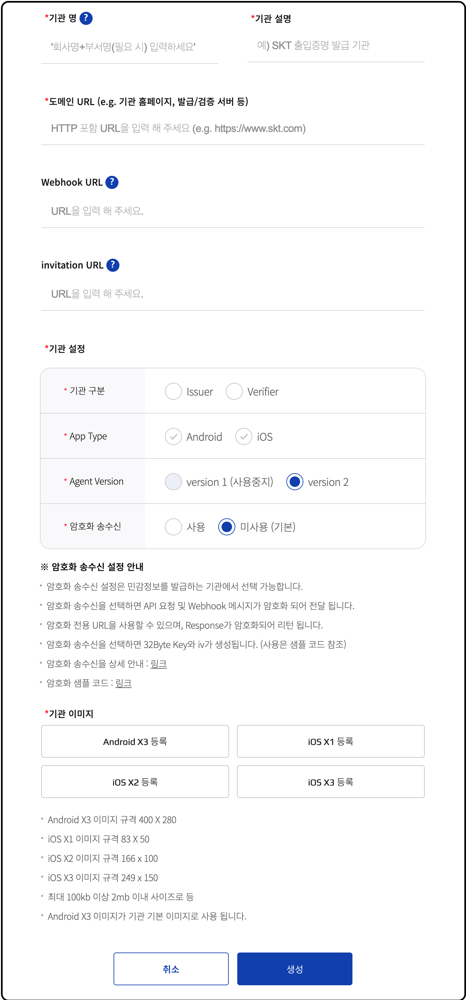
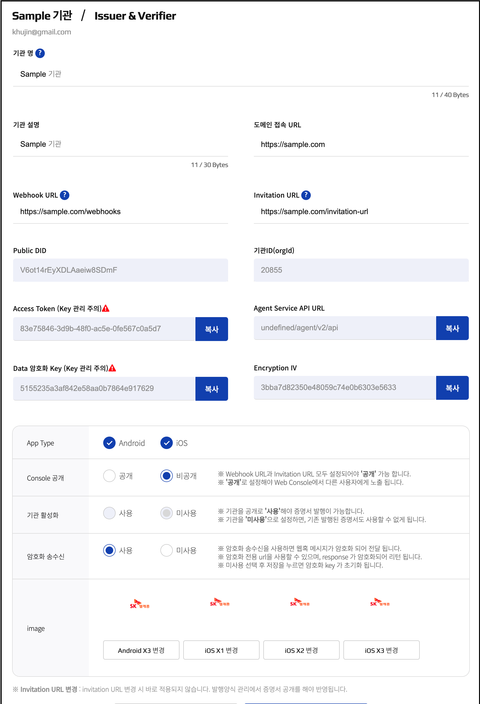

# Web Console 사용 Guide

* initial platform 사용을 위해서는 회원가입을 통한 자격을 취득 해야함 

    * 참고 : 2021년 2월 현재 사업자등록번호를 가진 기관사용자만 이용 가능 (추후 개인 사용자 확대 예정)  

#### 1. 회원 가입

E-mail기반 회원 가입 진행
  

#### 2. Master 신청
Master는 기관을 생성하고 증명서 양식을 생성하거나 검증할 수 있는 권한이 부여 되고, Member를 기관에 초대할 수 있음. 

Master 권한이 필요없는 일반 User는 초대를 통해서 platform 사용 가능(읽기권한만 부여)

회원가입 후 기관 사용자는 Master 신청을 진행
* Master 신청 시 사업자번호 등 회사 정보 등록
* 심사를 통해 Master 자격 승인 부여

#### 3. 기관생성하기 
Master는 '기관 생성하기' 버튼을 클릭하여 기관(Organization)을 여러개 생성 가능

* 2021.02 현재 최대 5개까지 기관 생성 허용

하나의 기관으로 여러 서비스를 진행 하거나, 각 기관마다 서비스를 분리 가능함.

* 사용자의 혼돈을 최소화 하기 위해서는 하나의 기관으로 다수의 서비스 하는 것을 추천

기관마다 독립된 Public DID와 Private/Public Key/API Access Token이 생성

* 해당 정보는 기관정보에서 확인할 수 있음 

이미 기관이 생성되어 있다면 해당 리스트가 표시된다.

* Owner : 기관의 주인으로 보통 생성한 Master가 Owner가 된다. 다른 User에게 위임도 가능하다 
* Member : Owner의 초대를 받아 들어올 수 있다. Read의 권한만 주어진다. 

기관 생성을 위해서는 아래와 같이 기관 이미지(initial app 노출 아이콘)이 필요하다.

기관 생성후 아래의 API Access Token 정보를 Secure 하게 관리해야 한다. 
해당 Token이 노출되면 악용되거나, 추가적인 과금이 발생할 수 있다.

#### 4. 발행양식 생성하기 

증명서 발행을 위해서는 각 기관마다 발행양식(Credential Definition ID) 생성이 필요하다. 
발행양식은 기본양식(Schema ID)기반으로 폐기지원여부, 증명서이름, 증명서발행개수등 설정값을 추가하여 생성이 가능하다. 
initial은 재직증명서, 재학증명서등 기본양식을 미리 제공한다. 

    example) initial회사에서 재직증명서 발행을 위해서는 initial재직증명서 발행양식을 생성한 후, initial app에 발행 가능하다.  

* 새로운 기본양식 생성이 필요하면 initial 관리자에게 별도 요청해야 한다.

생성된 발행양식은 해당 기관에서만 사용 가능하다.
 

 
 
 
#### 5. 발행하기 

VC발행을 위해서는 Open API를 사용하여 진행.

* Open API 사용하기 위해서는 기관의 API Access Token과 증명서양식I(Credential Definition ID)가 필요함

#### 6. 검증양식 생성하기 

증명서 검증을 위해서는 제출 받을 증명서양식(Verification Template ID) 생성이 필요하다. 
검증양식 생성을 위해서는 제출 받을 양식의 몇가지 제약사항을 설정해야 한다. 

1. 기본양식(Schema ID)기반으로 생성 : 해당 기본양식으로 발행된 모든 증명서 제출 가능 (SKT재직증명,삼성전자재직증명서,LG전자재직증명서등 모두 제출 가능)
2. 참여기관별 증명양식(Credential Definition ID)기반 생성  : 특정 증명서만 제출 가능 (SKT재직증명서만 제출 가능. 다른 재직증명서는 검증실패)

initial에서 제공하는 증명서 양식 기반으로 제출 받을 내용을 선택하면 된. 

    example) SKT임직원 행사를 위해 'SKT재직증명서'의 회사명과 이름을 제출하게 양식 생성 

* 영지식증명, 멀티증명서제출검증등 항목 생성은은 향후 지원 예정.

 

#### 7. 검증하기 

VC발행을 위해서는 Open API를 사용하여 진행.

* Open API 사용하기 위해서는 기관의 API Access Token과 Verification Template ID 필요함